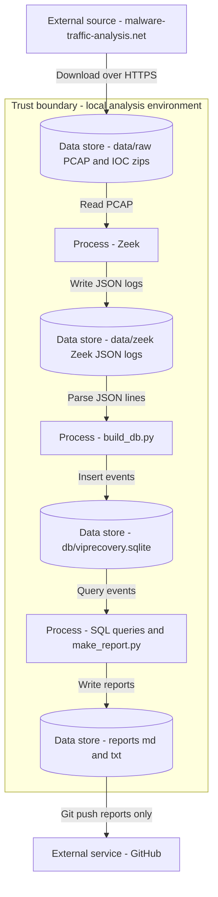

# Threat Model

For this repo I will use DFD + STRIDE in my threat modelling.

## Assets & Security Goals

### Primary assets
- **Evidence integrity:** the original PCAP and IOC text files must remain unmodified so results are attributable to the same evidence.
- **Analysis integrity:** Zeek outputs, the SQLite database, and generated reports should accurately reflect the evidence.
- **Confidentiality of artifacts:** avoid accidentally leaking PCAPs, raw logs, databases, or other items that could contain sensitive indicators or data
- **Safety of the analysis environment:** prevent accidental execution of untrusted content during analysis.

### Security goals
- **Reproducibility:** the project should be runnable end-to-end with deterministic steps and documented versions so results can be reproduced and inspected.
- **Controlled data handling:** raw evidence is treated as read-only; derived items are kept separate and are not published by default.
- **Least privilege:** run analysis tooling as an unprivileged user wherever possible to reduce impact if a tool or input triggers unexpected behavior.
- **Clear limitations:** explicitly document analysis limitations to avoid over-claiming conclusions.

## Data Flow Diagram

Below is the DFD I will be using to model my system.

## Spoofing
- Download source spoofing (wrong file / mirror): mitigate by downloading over HTTPS and verify integrity (SHA256) and provenance (expected filename + source URL recorded)

## Tampering
- PCAP/log/DB/report modified after analysis: mitigate by hashing inputs/outputs, clean rebuild script, treating raw data as immutable
- Duplicate imports causing distorted results: mitigate by enforcing an SQL UNIQUE constraint on a stable event identity, or always rebuild from scratch

## Repudiation
- Inability to reproduce/verify results: record Zeek/Python versions, PCAP SHA256, exact commands executed, pip freeze for dependency snapshot, and keeping important SQL queries in my repo

## Information Disclosure
- Accidentally committing PCAP/Zeek logs/DB to GitHub: mitigate by using .gitignore and a pre-push hook that blocks commits containing data/raw, data/zeek, db/ or .pcap paths

## Denial of Service
- Large PCAP or malformed logs causing resource exhaustion: mitigate by file size limits (warn/abort if PCAP exceeds threshold), and reading JSON line-by-line in batches; avoiding loading entire logs into RAM

## Elevation of Privilege
- Running tools as root / opening risky artifacts leading to compromise: mitigate by running analysis as a normal user, avoiding any payload zips which could contain malware, keeping work in an isolated VM/WSL environment