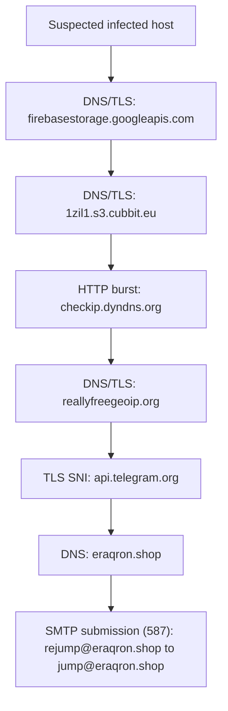

# Incident report

## Executive Summary

An influx of network activity lasing ~25 seconds shows behavior consistant with malware activity: outbound connections to cloud storage (content retrieval), public IP and geolocation lookup, Communications with Telegram infrastructure, and sending an outbound email via SMTP submission.

This report is based on network telemetry only. No endpoint data was available to confirm the intial infection method or data contents.

## Case Metadata

- Case name: VIP Recovery (2026-01-09 PCAP)
- Evidence: `2026-01-09-VIP-Recovery-traffic.pcap`
- Tools used: Zeek (JSON logs), SQLite (events table), SQL queries, summary report generator
- Time range: 2026-01-09 18:04:43 to 18:05:07 UTC
- Total Zeek events imported: 51

## High-Level Findings

Observed network indicators suggest the following stages:

1) Staging / retrieval via cloud infrastructure
- `firebasestorage.googleapis.com` (DNS + TLS)
- `1zil1.s3.cubbit.eu` (DNS + TLS)

2) External IP discovery / environment checks
- Repeated HTTP GETs to `checkip.dyndns.org` (public IP discovery)

3) Geolocation lookup
- `reallyfreegeoip.org` (DNS + TLS)

4) Outbound communications consistent with C2 / operator messaging channel
- `api.telegram.org` (DNS + TLS)

5) SMTP submission consistent with exfiltration or automated outbound messaging
- DNS lookup for `eraqron.shop`
- SMTP `MAIL FROM` / `RCPT TO` observed:
  - `rejump@eraqron.shop` -> `jump@eraqron.shop`

## Timeline (UTC)

Timestamps are derived from Zeek logs imported to SQLite.

- 18:04:43.417  DNS query: `firebasestorage.googleapis.com`
- 18:04:43.535  TLS session observed with SNI: `firebasestorage.googleapis.com`
- 18:04:45.902  DNS query: `1zil1.s3.cubbit.eu`
- 18:04:46.131  TLS session observed with SNI: `1zil1.s3.cubbit.eu`
- 18:04:48.444  DNS query: `checkip.dyndns.org`
- 18:04:48.819  HTTP GET: `checkip.dyndns.org/` (first observed HTTP request)
- 18:04:49.825  DNS query: `reallyfreegeoip.org`
- 18:04:49.947  TLS session observed with SNI: `reallyfreegeoip.org`
- 18:04:53.609  DNS query: `api.telegram.org`
- 18:04:53.797  TLS session observed with SNI: `api.telegram.org`
- 18:05:00.248  DNS query: `eraqron.shop`
- 18:05:01.106  SMTP observed: `rejump@eraqron.shop` -> `jump@eraqron.shop`
- 18:05:05.919  SMTP observed: `rejump@eraqron.shop` -> `jump@eraqron.shop`

Note that checkip.dyndns.org is observed multiple times within the window, consistent with repeated IP discovery.

## Incident Flow Diagram

The diagram below summarizes the sequence of network observables extracted from the PCAP

  
## Indicators of Compromise (IOCs)

### Domains / Hosts
- `firebasestorage.googleapis.com`
- `1zil1.s3.cubbit.eu`
- `checkip.dyndns.org`
- `reallyfreegeoip.org`
- `api.telegram.org`
- `eraqron.shop`

### Email addresses (from SMTP metadata)
- Sender: `rejump@eraqron.shop`
- Recipient: `jump@eraqron.shop`

## Detection Opportunities

These are simple, explainable detections aligned with the observed behavior:

- External IP discovery burst:
  - Trigger when a host performs multiple HTTP requests to public IP check services (e.g., `checkip.*`) within a short interval.

- Suspicious staging pattern:
  - Trigger when a host contacts cloud-hosted object storage domains shortly before/after IP/geo checks.

- Telegram endpoint contact from non-approved endpoints:
  - Trigger when TLS SNI indicates `api.telegram.org` from endpoints where Telegram is not expected.

- SMTP submission from user endpoints:
  - Trigger on outbound SMTP (587) from non-mail-server hosts, especially if sender/recipient domains are rare
    or newly observed.

## Recommended Response Actions

If this were a live enterprise incident, recommended actions would be:

1) Containment
- Isolate the suspected endpoint from the network pending review.
- Temporarily block or monitor the identified domains at DNS/proxy layers.

2) Investigation
- Acquire endpoint telemetry: process creation, script execution logs, email client artifacts, and any dropped files.
- Search for additional hosts contacting the same IOCs in the same timeframe.

3) Eradication and Recovery
- Remove persistence mechanisms and malicious files (requires endpoint evidence).
- Reset credentials if there is any possibility of credential theft/exfiltration.

4) Prevention / Hardening
- Restrict script execution where not required; secure attachment handling.
- Enforce egress controls: limit outbound SMTP from endpoints; route through sanctioned relays only.
- Add detections for the patterns above (IP check burst, cloud staging + geo + Telegram, unusual SMTP).

## Scope and Limitations

- Scope: Network-only analysis from a single PCAP.
- Limitations:
  - Encrypted traffic (TLS) limits visibility of full request/response content; SNI and metadata only.
  - No endpoint telemetry (process tree, file hashes, registry, EDR events), so conclusions are based on network indicators and sequencing.
  - This report does not attempt reverse engineering of payloads; it focuses on observable network behavior.

  ## Reproducibility Notes (for this repo)

This report can be reproduced from the repo pipeline:
- PCAP -> Zeek JSON logs -> SQLite import -> SQL queries -> summary report
- The `scripts/rebuild.sh` script is intended to clean outputs to avoid duplicated rows.